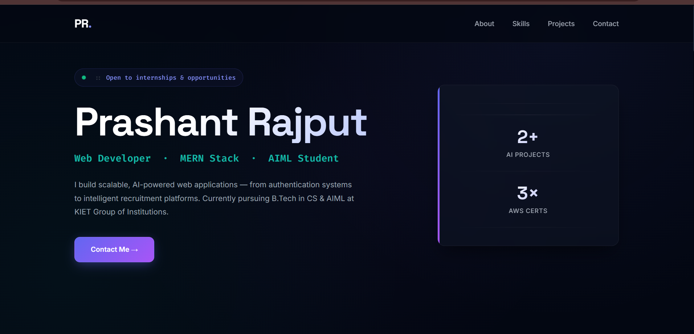
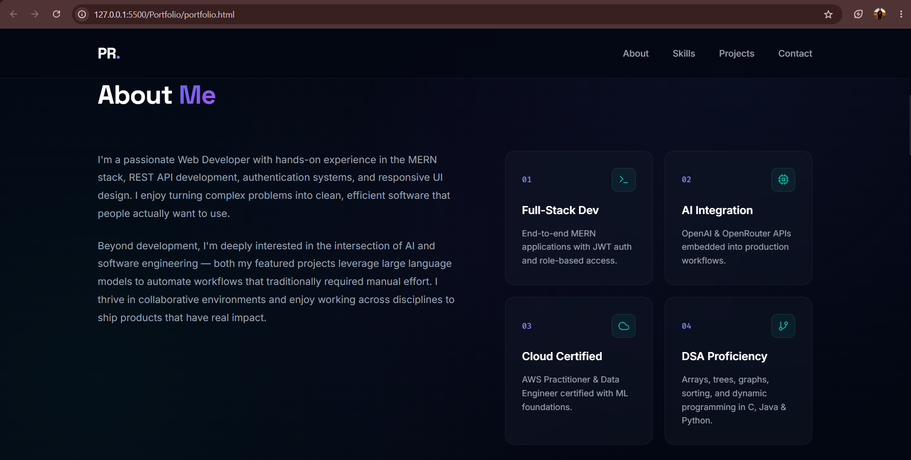
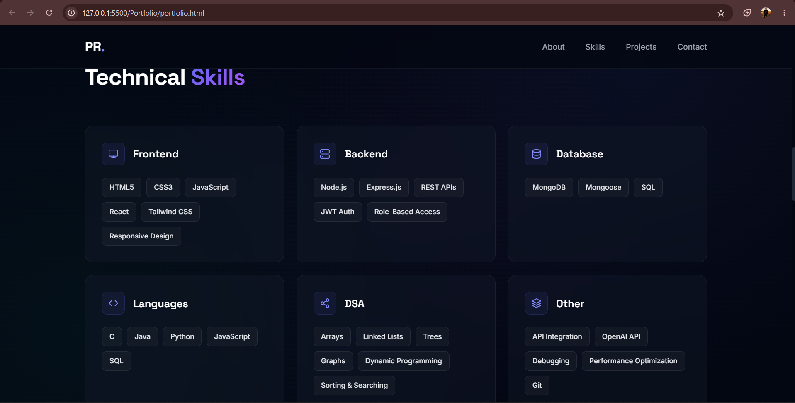
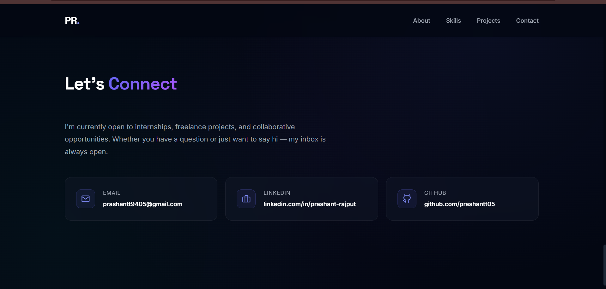

# 🚀 Personal Portfolio Website

A modern, responsive developer portfolio built using **HTML5** and **CSS3**. This portfolio showcases my profile, technical skills, featured projects, certifications, education, and contact information through a clean dark-themed user interface with smooth layouts and responsive design.

## 🌐 Live Preview

> Add your deployed portfolio link here

```
[https://your-portfolio-link.com](https://prashantt05.github.io/synent-task1-Personal-Portfolio-Website-prashant/)
```

---

# 📸 Project Preview

## 🏠 Hero Section

The landing page introduces me as a MERN Stack Developer with quick highlights, availability status, and project statistics.



---

## 👨‍💻 About Section

This section provides an overview of my background, development experience, AI interests, and key strengths.



---

## 💻 Technical Skills

Displays categorized technical skills including Frontend, Backend, Database, Languages, DSA, and other technologies in a modern card layout.



---

## 📬 Contact Section

Provides multiple ways to connect including Email, LinkedIn, and GitHub.



---

# ✨ Features

- Modern Dark UI
- Fully Responsive Design
- Clean Navigation Bar
- Hero Section with Quick Stats
- About Section
- Technical Skills Cards
- Featured Projects
- AWS Certifications
- Education Timeline
- Contact Cards
- Smooth Hover Effects
- Mobile Friendly Layout
- Glassmorphism Inspired Cards
- Gradient Buttons & Typography

---

# 🛠️ Technologies Used

- HTML5
- CSS3
- Flexbox
- CSS Grid
- Google Fonts
- SVG Icons

---

# 📂 Project Structure

```
Portfolio/
│
├── index.html
├── style.css
├── assets/
│   ├── hero.png
│   ├── about.png
│   ├── skills.png
│   └── contact.png
│
└── README.md
```

---

# 🎯 Sections Included

- Hero
- About
- Technical Skills
- Featured Projects
- Certifications
- Education
- Contact
- Footer

---

# 🎨 Design Highlights

- Modern Developer Portfolio
- Dark Theme UI
- Indigo & Cyan Accent Colors
- Responsive Grid Layout
- Glassmorphism Cards
- Gradient Buttons
- Hover Animations
- Clean Typography
- Professional Spacing

---

# 📱 Responsive Design

The portfolio is fully responsive and optimized for:

- 💻 Desktop
- 💼 Laptop
- 📱 Mobile
- 📟 Tablet

---

# 🚀 Featured Projects

### SmartResolve

An AI-powered Complaint Management System that uses OpenAI APIs to automatically classify complaints and route them to the appropriate departments.

**Tech Stack**

- MERN Stack
- JWT Authentication
- REST APIs
- OpenAI API

---

### TalentAI

An AI-powered Resume Screening platform that automatically analyzes resumes against job descriptions and ranks candidates.

**Tech Stack**

- MERN Stack
- OpenRouter AI
- REST APIs
- Tailwind CSS

---

# 🏆 Certifications

- AWS Certified Cloud Practitioner
- AWS Certified Data Engineer – Associate
- AWS Academy Machine Learning Foundations

---

# 📫 Contact

**Email**

```
prashantt9405@gmail.com
```

**LinkedIn**

```
linkedin.com/in/prashant-rajput
```

**GitHub**

```
github.com/prashantt05
```

---

# ⚡ Getting Started

Clone the repository

```bash
git clone https://github.com/yourusername/portfolio.git
```

Go to project folder

```bash
cd portfolio
```

Open

```bash
index.html
```

or run using VS Code Live Server.

---

# 📄 License

This project is open-source and available under the MIT License.

---

## 👨‍💻 Author

### Prashant Rajput

MERN Stack Developer | AI & ML Enthusiast | B.Tech CSE (AIML)

⭐ If you like this project, don't forget to give it a star.
